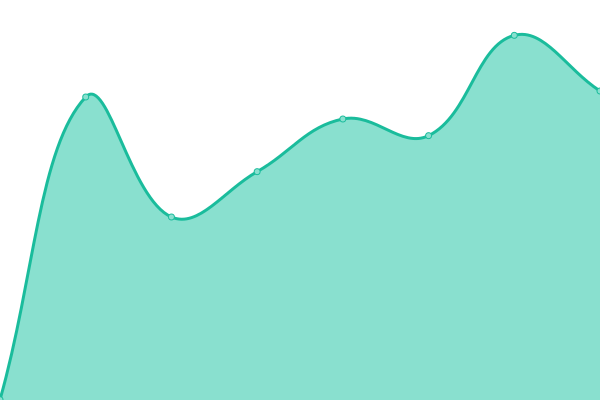
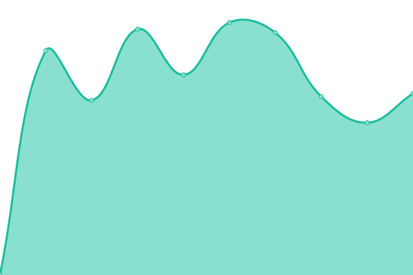

# [📈 Live Status](https://pitgrap.github.io/upptime-status): <!--live status--> **🟩 All systems operational**

This repository contains the open-source uptime monitor and status page for [Michael Riehemann](https://www.coremedia.com), powered by [Upptime](https://github.com/upptime/upptime).

With [Upptime](https://upptime.js.org), you can get your own unlimited and free uptime monitor and status page, powered entirely by a GitHub repository. We use [Issues](https://github.com/pitgrap/upptime-status/issues) as incident reports, [Actions](https://github.com/pitgrap/upptime-status/actions) as uptime monitors, and [Pages](https://pitgrap.github.io/upptime-status) for the status page.

<!--start: status pages-->
<!-- This summary is generated by Upptime (https://github.com/upptime/upptime) -->
<!-- Do not edit this manually, your changes will be overwritten -->

| URL                                       | Status | History                                                                                       | Response Time                                                                 | Uptime                                                                                                                                                                                                             |
| ----------------------------------------- | ------ | --------------------------------------------------------------------------------------------- | ----------------------------------------------------------------------------- | ------------------------------------------------------------------------------------------------------------------------------------------------------------------------------------------------------------------ |
| [Server 1](https://server1.riehemann.net) | 🟩 Up  | [server-1.yml](https://github.com/pitgrap/upptime-status/commits/master/history/server-1.yml) |  596ms |   |
| [Server 2](https://server2.riehemann.net) | 🟩 Up  | [server-2.yml](https://github.com/pitgrap/upptime-status/commits/master/history/server-2.yml) |  607ms |  |

<!--end: status pages-->

[**Visit our status website →**](https://pitgrap.github.io/upptime-status)

## 📄 License

- Code: [MIT](./LICENSE) © [Michael Riehemann](https://www.coremedia.com)
- Data in the `./history` directory: [Open Database License](https://opendatacommons.org/licenses/odbl/1-0/)
