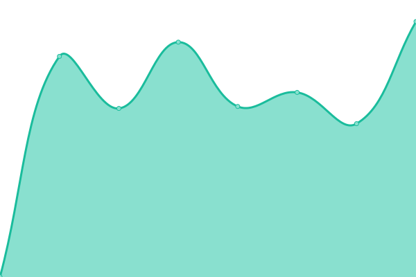

# [📈 Live Status](https://status.riehemann.net): <!--live status--> **🟩 All systems operational**

This repository contains the open-source uptime monitor and status page for Riehemann IT-Consulting, powered by [Upptime](https://github.com/upptime/upptime).

With [Upptime](https://upptime.js.org), you can get your own unlimited and free uptime monitor and status page, powered entirely by a GitHub repository. We use [Issues](https://github.com/riehemann-it/upptime-status/issues) as incident reports, [Actions](https://github.com/riehemann-it/upptime-status/actions) as uptime monitors, and [Pages](https://status.riehemann.net) for the status page.

<!--start: status pages-->
<!-- This summary is generated by Upptime (https://github.com/upptime/upptime) -->
<!-- Do not edit this manually, your changes will be overwritten -->
<!-- prettier-ignore -->
| URL | Status | History | Response Time | Uptime |
| --- | ------ | ------- | ------------- | ------ |
|  [Server 1](https://server1.riehemann.net) | 🟩 Up | [server-1.yml](https://github.com/riehemann-it/upptime-status/commits/HEAD/history/server-1.yml) | 

 848ms
     
 | 

<a href="https://status.riehemann.net/history/server-1">100.00%</a>
    

|  [Server 2](https://server2.riehemann.net) | 🟩 Up | [server-2.yml](https://github.com/riehemann-it/upptime-status/commits/HEAD/history/server-2.yml) | 

 859ms
     
 | 

<a href="https://status.riehemann.net/history/server-2">100.00%</a>
    

<!--end: status pages-->

[**Visit our status website →**](https://status.riehemann.net)

## 📄 License

- Code: [MIT](./LICENSE) © Riehemann IT-Consulting
- Data in the `./history` directory: [Open Database License](https://opendatacommons.org/licenses/odbl/1-0/)
